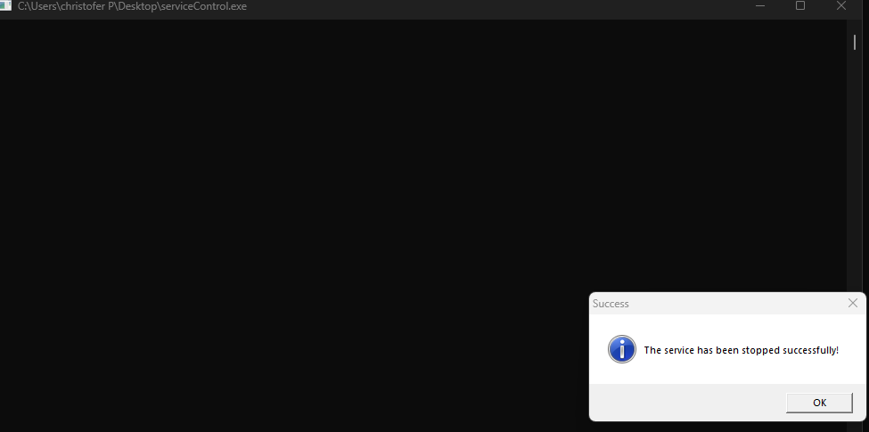
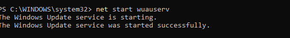

If you want to test the program 

donwload both executables but just run elevevatePrivileges.exe
  

IF WUAUSERV IS NOT RUNNING 
  open an admin powershell(PS) 

 

 
 
# priv_
The Service Control Manager (SCM) is a remote procedure call (RPC) server. It is started at system boot and allows service configuration and service control programs to manipulate services on remote machines.

OpenProcessToken: This function is used to open a handle to the access token of a process. An access token is an object that holds information about a process's security context, including its privileges
OpenProcessToken: This function is used to open a handle to the access token of a process. An access token is an object that holds information about a process's security context, including its privileges.
Arguments:

GetCurrentProcess(): This retrieves a handle for the current process itself.

TOKEN_ADJUST_PRIVILEGES | TOKEN_QUERY:  This specifies the desired access rights for the opened token. Here, it combines two access rights using the bitwise OR operator (|):

TOKEN_ADJUST_PRIVILEGES: This allows modifying the privileges associated with the token. However, not all processes have permission to adjust privileges.

TOKEN_QUERY: This allows querying information from the token, such as the process's privileges.
&hToken: This is a pointer to a variable of type HANDLE. The function will store the handle to the opened token at this memory location if successful.

<title2>if (serviceManager): This condition checks if the serviceManager variable holds a valid handle. This handle is likely obtained from a previous call to a function like OpenSCManager.
Opening Service Handle:</title2>

Functionality:
If the function call is successful, it opens a handle to the current process's access token and stores the handle in the hToken variable (pointed to by the address).
You can then use this handle with other functions to query information about the process's privileges or potentially adjust them (if the process has sufficient permissions).

SC_HANDLE service = OpenService(serviceManager, "wuauserv", SERVICE_START | SERVICE_STOP);:
OpenService: This function attempts to open a handle to a service identified by a specific name.
serviceManager: This argument is the handle to the service control manager (SCM) obtained earlier. The SCM manages all services on the system.
"wuauserv": This is the name of the service you're trying to open a handle to. In this case, it's "wuauserv," which is the Windows Update service.
SERVICE_START | SERVICE_STOP: This specifies the desired access rights for the opened service handle. Here, it combines two access rights using the bitwise OR operator (|):
SERVICE_START: This allows starting the service if it's currently stopped.
SERVICE_STOP: This allows stopping the service if it's currently running.
Functionality:

If the serviceManager handle is valid and the OpenService function succeeds, a handle to the specified service ("wuauserv" in this case) will be stored in the service variable.
 ****Additional notes****  
 What is a handle? 

<b>HANDLE is a typedef that typically resolves to a void* pointer. This means it can hold the memory address of various resources depending on the context.</b>
  Some examples include  

<b>Socket Handle</b>
SOCKET hSocket = socket(AF_INET, SOCK_STREAM, 0);

<b>Registry Key Handle</b>
HKEY hKey;
RegOpenKeyEx(HKEY_LOCAL_MACHINE, L"SOFTWARE\\MyApp", 0, KEY_READ, &hKey);
 <b>File Mapping Handle</b> 
HANDLE hFileMapping = CreateFileMapping(INVALID_HANDLE_VALUE, NULL, PAGE_READWRITE, 0, 4096, L"MyFileMapping");

<b>Semaphore Handle</b>
HANDLE hSemaphore = CreateSemaphore(NULL, 1, 1, L"MySemaphore");

<b>Event Handle</b>
HANDLE hEvent = CreateEvent(NULL, FALSE, FALSE, L"MyEvent");

<b>Mutex Handle</b>
HANDLE hMutex = CreateMutex(NULL, FALSE, L"MyMutex");

<b>Process Handle</b>
HANDLE hProcess = OpenProcess(PROCESS_ALL_ACCESS, FALSE, processId);

<b>Thread Handle</b>
HANDLE hThread = CreateThread(NULL, 0, ThreadFunction, NULL, 0, NULL);

<b>File Handle</b>
HANDLE hFile = CreateFile(L"example.txt", GENERIC_READ, 0, NULL, OPEN_EXISTING, FILE_ATTRIBUTE_NORMAL, NULL);
